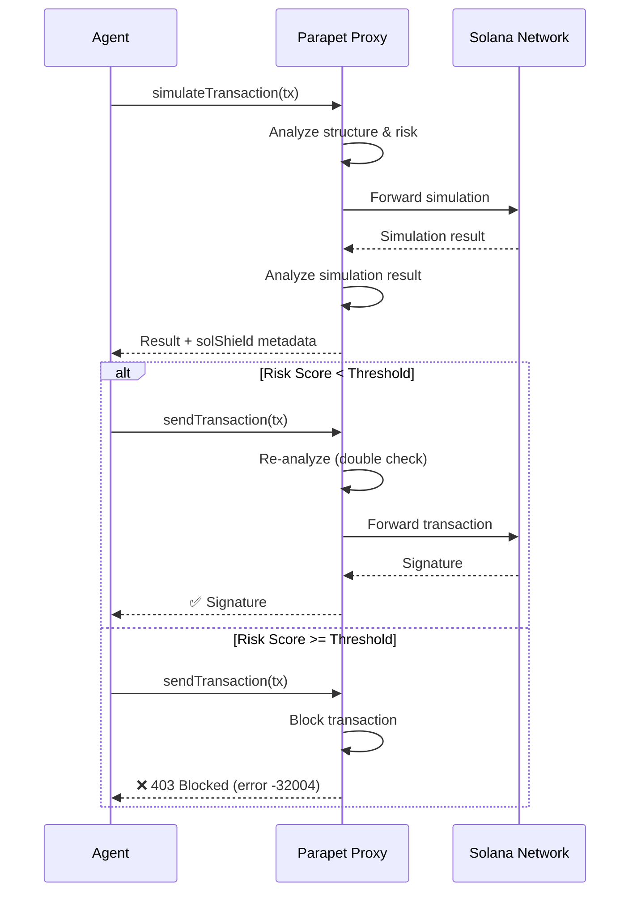
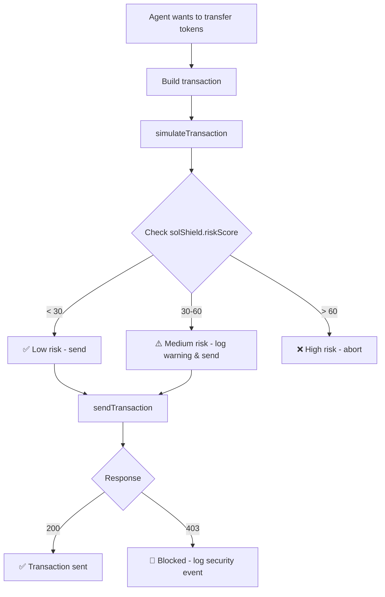
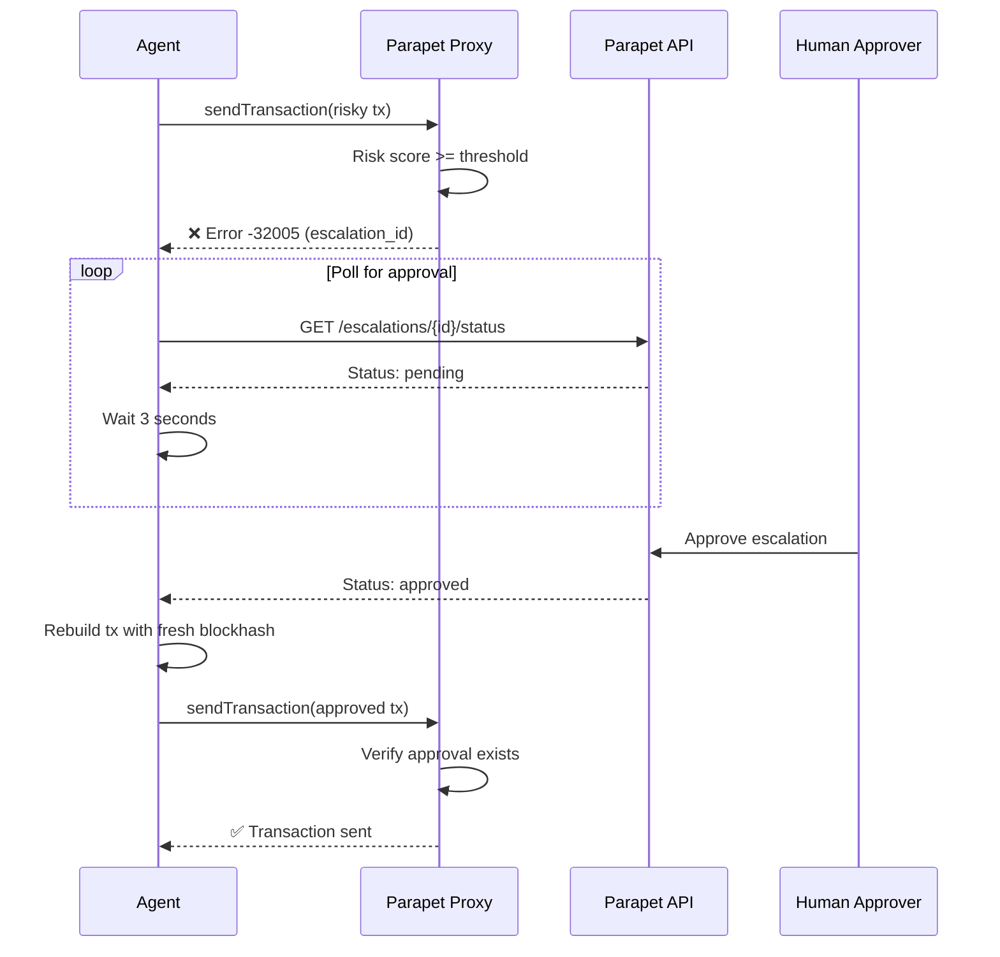

# Parapet Agent Integration Guide

**For:** AI agents (OpenClaw, Cursor AI, autonomous traders) integrating with Parapet RPC proxy

## Overview

Parapet is a Solana RPC proxy that analyzes transactions for security risks before submission. It supports HTTP JSON-RPC methods and adds risk scoring metadata to responses without modifying transactions or storing keys.

**Supported:** HTTP JSON-RPC (transaction submission, queries)  
**Not Yet Supported:** WebSocket subscriptions (real-time updates)

## Workflow



## Quick Start

### 1. Configure Connection

Point your Solana client to Parapet instead of a standard RPC:

```typescript
// Standard RPC (unprotected)
const connection = new Connection('https://api.mainnet-beta.solana.com');

// Parapet RPC (protected) - for transaction submission
const connection = new Connection('http://localhost:8899');

// If you need WebSocket subscriptions for real-time updates:
const wsConnection = new Connection('https://api.mainnet-beta.solana.com', 'confirmed');
// Use wsConnection.onAccountChange(), onSignatureChange(), etc.
```

### 2. Use Standard RPC Methods

**Supported HTTP JSON-RPC methods:**
- `sendTransaction` - Analyzed before forwarding, blocked if risk > threshold
- `simulateTransaction` - Returns enriched `solShield` metadata
- `getLatestBlockhash`, `getBalance`, etc. - Pass through directly

### 3. Handle Security Analysis

#### Simulation with Risk Analysis

```typescript
const simulation = await connection.simulateTransaction(tx);
const solShield = simulation.value.solShield;

console.log(`Risk Score: ${solShield.riskScore}`);
console.log(`Decision: ${solShield.decision}`); // "safe" | "alert" | "would_block"

if (solShield.warnings.length > 0) {
  solShield.warnings.forEach(w => {
    console.log(`[${w.severity}] ${w.message}`);
  });
}
```

#### Sending Transactions

```typescript
try {
  const signature = await connection.sendTransaction(tx, [signer]);
  console.log('✅ Transaction sent:', signature);
} catch (error) {
  if (error.code === -32004) {
    // Blocked by Parapet
    console.error('🚫 BLOCKED:', error.message);
    console.log('Risk score:', error.data.risk_score);
    console.log('Matched rules:', error.data.matched_rules);
  } else if (error.code === -32005) {
    // Human approval required (escalation)
    console.log('Escalation ID:', error.data.escalation_id);
    // Poll for approval or notify user
  }
}
```

## Response Structure

### solShield Metadata

Added to `simulateTransaction` responses:

```typescript
{
  version: "1.0.0",
  riskScore: 45,              // 0-100
  structuralRisk: 30,         // Risk from transaction structure
  simulationRisk: 15,         // Risk from simulation results
  decision: "alert",          // "safe" | "alert" | "would_block"
  threshold: 70,              // Configured blocking threshold
  warnings: [
    {
      severity: "medium",     // "low" | "medium" | "high" | "critical"
      message: "Transaction delegates unlimited token approval",
      ruleId: "token_unlimited_delegate",
      ruleName: "Unlimited Token Delegation",
      weight: 30
    }
  ],
  analysis: {
    matchedRules: 2,
    totalWeight: 45,
    wouldBlock: false
  }
}
```

## Error Codes

- `-32004` - Transaction blocked by security rules (risk > threshold)
- `-32005` - Escalation required (human-in-the-loop approval needed)
- `429` - Rate limited (check `X-Rate-Limit-Remaining` header)

## Use Cases

### Use Case 1: Safe Token Transfer



### Use Case 2: Human-in-the-Loop Escalation



## Best Practices

### 1. Always Simulate First

```typescript
// 1. Simulate to check risk
const sim = await connection.simulateTransaction(tx);
if (sim.value.solShield?.wouldBlock) {
  console.log('Transaction would be blocked, aborting');
  return;
}

// 2. Check against your own risk tolerance
if (sim.value.solShield?.riskScore > 50) {
  console.log('Risk too high for agent tolerance');
  return;
}

// 3. Send if safe
const sig = await connection.sendTransaction(tx, [signer]);
```

### 2. Log Security Events

Track blocked transactions and high-risk warnings for audit trails.

### 3. Handle Escalations

When `-32005` is returned, poll `/api/v1/escalations/{id}/status` for approval:

```typescript
const escalationId = error.data.escalation_id;
const status = await fetch(`${API_URL}/api/v1/escalations/${escalationId}/status`);
const data = await status.json();

if (data.status === 'approved') {
  // Rebuild transaction with fresh blockhash and retry
}
```

### 4. Respect Rate Limits

Check `X-Rate-Limit-Remaining` header and implement backoff when approaching limits.

## Authentication

Set API key if required:

```typescript
// HTTP header
headers: {
  'X-API-Key': 'sk_your_api_key'
}

// Or environment variable
X_API_KEY=sk_your_api_key
```

## Example Integrations

See working examples in `/examples`:
- `agent-integration-example.ts` - TypeScript integration
- `agent-integration-example.py` - Python integration
- `openclaw-mcp-server.ts` - MCP server with escalation support

## Testing

```bash
# Health check
curl http://localhost:8899/health

# Test RPC pass-through
curl http://localhost:8899 \
  -H "Content-Type: application/json" \
  -d '{"jsonrpc":"2.0","id":1,"method":"getHealth"}'
```

## Risk Decision Logic

- **risk_score < threshold**: Transaction passes (forwarded to network)
- **risk_score >= threshold**: Transaction blocked (403 response)
- **Threshold default**: 70 (configurable via `DEFAULT_BLOCK_THRESHOLD`)

## Support

- Issues: GitHub Issues
- Logs: Check Parapet proxy logs for detailed analysis
- Testing: Use devnet/testnet before mainnet integration
