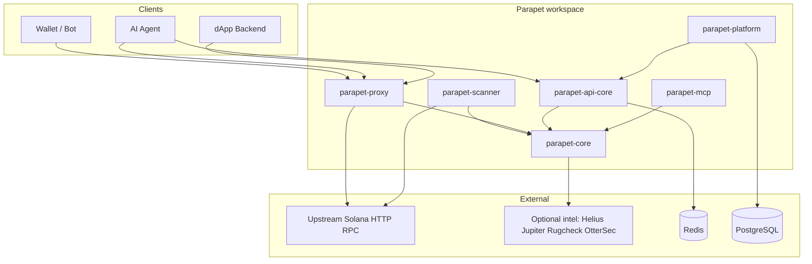
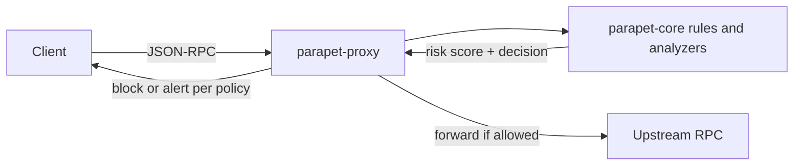
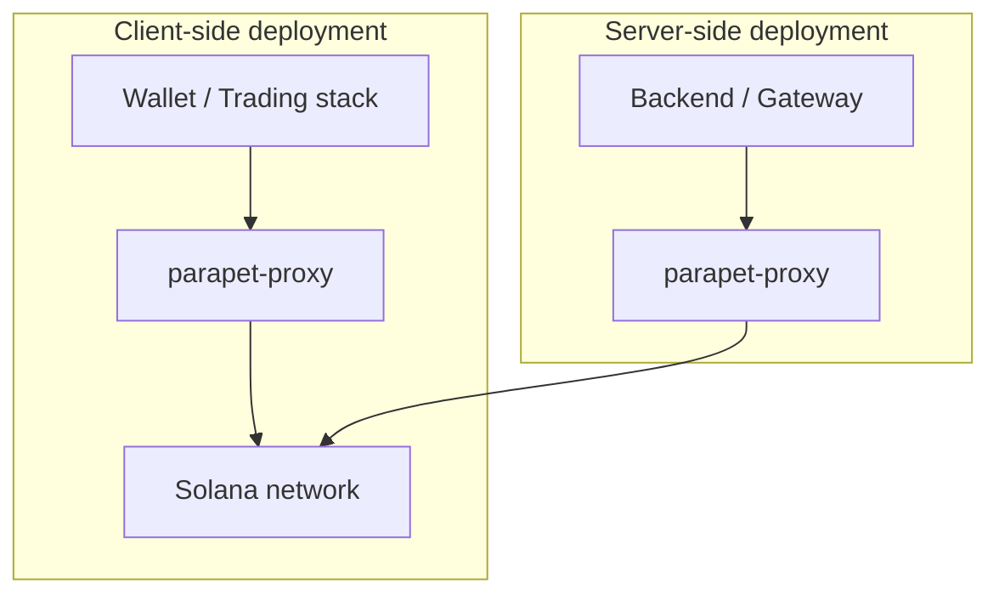
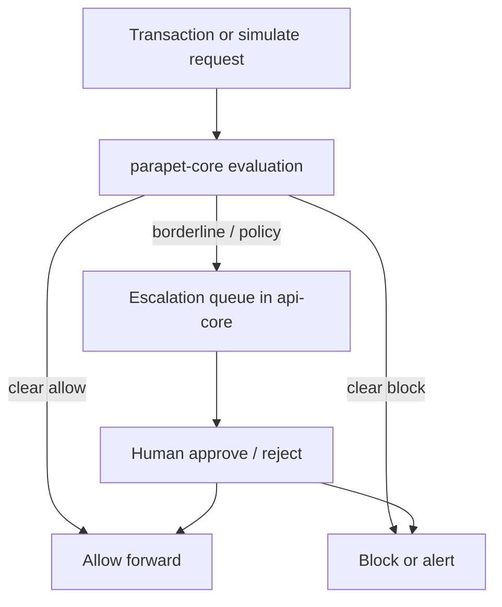
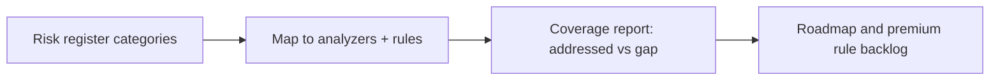
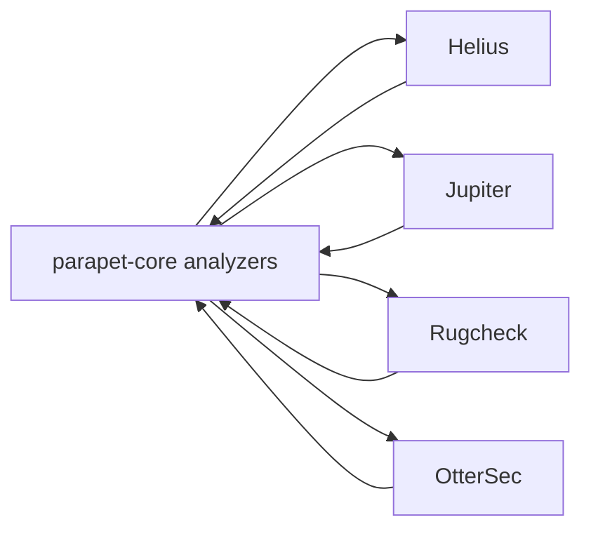

# Parapet — Architecture

*Companion to the project design record in `[OVERVIEW.md](OVERVIEW.md)`.*

Mermaid diagrams for stakeholders and engineers. Render in GitHub, Notion, or any Mermaid-capable viewer.

---

## 1. High-level system context

---

## 2. Perimeter IDS/IPS (RPC proxy)

---

## 3. Dual deployment mental model

Same engine and rules; placement of **parapet-proxy** changes the trust boundary (client path vs server/gateway path).

---

## 4. Transaction decision and escalation

---

## 5. Risk register alignment (conceptual)

---

## 6. Optional third-party enrichment

---

*Diagrams describe architecture; refer to crate READMEs for exact endpoints and configuration.*