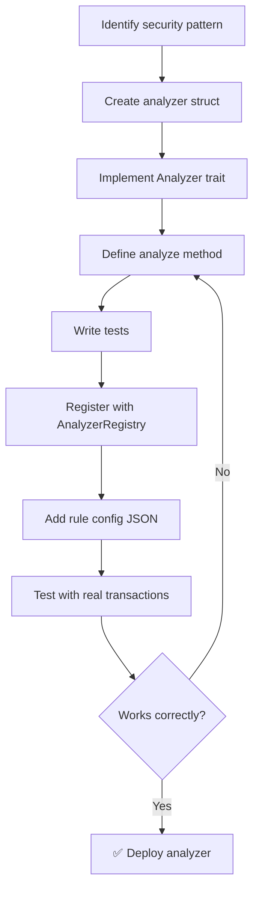
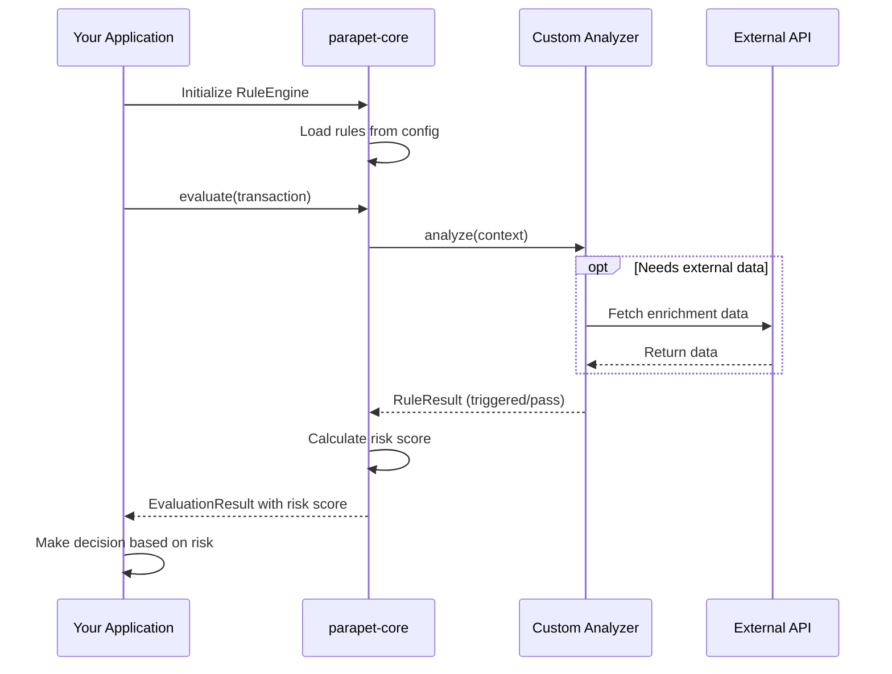

# Parapet Developer Guide

**For:** Developers building with or extending Parapet

## Development Workflows

### Building a Custom Analyzer




### Integration Flow




## Using Parapet as a Library

### Installation

```toml
[dependencies]
parapet-core = { path = "../core" }
solana-sdk = "2.3"
tokio = { version = "1", features = ["full"] }
```

### Basic Usage

```rust
use parapet_core::rules::{AnalyzerRegistry, RuleEngine, RiskLevel};
use solana_sdk::transaction::Transaction;
use std::sync::Arc;

#[tokio::main]
async fn main() -> anyhow::Result<()> {
    // Create analyzer registry (core analyzers auto-registered)
    let registry = Arc::new(AnalyzerRegistry::new());
    
    // Load rules engine from config
    let engine = RuleEngine::from_file("rules.json", registry)?;
    
    // Analyze transaction
    let tx: Transaction = build_transaction();
    let result = engine.evaluate(&tx).await?;
    
    // Handle result
    match result.risk_level {
        RiskLevel::Critical => println!("🚫 BLOCK: {}", result.message),
        RiskLevel::High => println!("⚠️  WARN: {}", result.message),
        RiskLevel::Low => println!("✅ PASS"),
    }
    
    Ok(())
}
```

## Writing Custom Rule Analyzers

### 1. Create Analyzer

```rust
use parapet_core::rules::{Analyzer, AnalysisContext, RuleResult};
use async_trait::async_trait;

pub struct MyCustomAnalyzer;

#[async_trait]
impl Analyzer for MyCustomAnalyzer {
    fn name(&self) -> &str {
        "my_custom_analyzer"
    }
    
    async fn analyze(&self, ctx: &AnalysisContext) -> anyhow::Result<RuleResult> {
        // Access transaction data
        let tx = &ctx.transaction;
        
        // Perform analysis
        if is_suspicious(tx) {
            return Ok(RuleResult::triggered(
                "Suspicious pattern detected",
                50 // weight
            ));
        }
        
        Ok(RuleResult::pass())
    }
}
```

### 2. Register Analyzer

```rust
let mut registry = AnalyzerRegistry::new();
registry.register("my_custom_analyzer", Box::new(MyCustomAnalyzer));
```

### 3. Add Rule Configuration

```json
{
  "rules": [
    {
      "id": "custom_check",
      "name": "My Custom Check",
      "analyzer": "my_custom_analyzer",
      "enabled": true,
      "weight": 50,
      "params": {
        "threshold": 100
      }
    }
  ]
}
```

## Core Analyzers

Built-in analyzers in `core/src/rules/analyzers/`:

### Core Analyzers

- `basic` - Account ownership, balance changes
- `token_instructions` - Token transfers, delegations
- `core_security` - Authority changes, dangerous instructions
- `complexity` - Transaction complexity metrics
- `system` - System program interactions

### Third-Party Analyzers

- `rugcheck` - Token risk scoring via RugCheck API
- `helius_identity` - Wallet verification via Helius
- `token_mint` - Token metadata validation

## Enrichment Services

Analyzers can use enrichment services for external data:

```rust
use parapet_core::enrichment::{EnrichmentService, rugcheck::RugCheckService};

let rugcheck = RugCheckService::new("https://api.rugcheck.xyz");
let report = rugcheck.get_token_report("EPjFWdd5...").await?;

if report.risk_level == "danger" {
    return Ok(RuleResult::triggered("High-risk token", 80));
}
```

## Testing Analyzers

```rust
#[cfg(test)]
mod tests {
    use super::*;
    
    #[tokio::test]
    async fn test_analyzer() {
        let analyzer = MyCustomAnalyzer;
        let ctx = build_test_context();
        
        let result = analyzer.analyze(&ctx).await.unwrap();
        assert!(result.triggered);
        assert_eq!(result.weight, 50);
    }
}
```

## Building the Project

```bash
# Build all components
cargo build --release

# Build specific component
cargo build -p parapet-core --release
cargo build -p parapet-proxy --release

# Run tests
cargo test

# Run with logging
RUST_LOG=debug cargo run -p parapet-proxy
```

## Project Structure

```
parapet/
├── core/           # Rule engine and analyzers (library)
├── proxy/          # RPC proxy server
├── scanner/        # Transaction scanner tool
├── api/            # REST API server
├── dashboard/      # Web dashboard
└── mcp-server/     # MCP server for AI agents
```

## Contributing

1. Write tests for new analyzers
2. Document rule parameters in analyzer comments
3. Use appropriate log levels (`debug`, `info`, `warn`, `error`)
4. Follow Rust conventions (clippy, rustfmt)

## Resources

- Core library: `core/README.md`
- Proxy / rules: `proxy/README.md`
- Analyzer examples: `core/src/rules/analyzers/`

