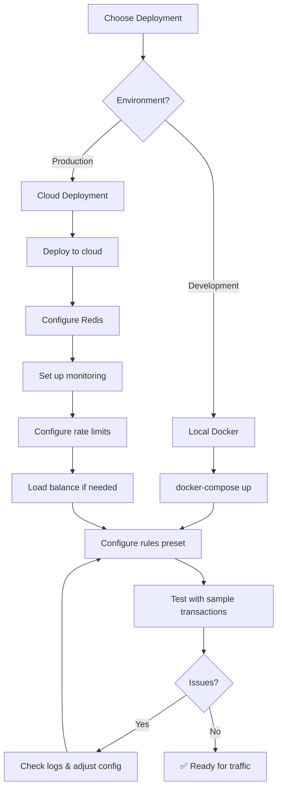
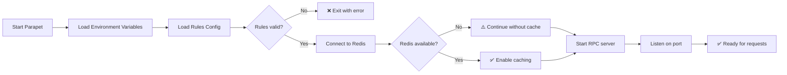

# Operations Guide

**For:** DevOps teams deploying and operating Parapet

## Deployment Workflow



## Configuration Flow



## Monitoring

### Key Metrics

```bash
# Request rate
grep "sendTransaction" /var/log/parapet/app.log | wc -l

# Block rate
grep "🚫 Transaction BLOCKED" /var/log/parapet/app.log | wc -l

# Error rate
grep "ERROR" /var/log/parapet/app.log | wc -l
```

### Health Check

```bash
curl http://localhost:8899 \
  -H "Content-Type: application/json" \
  -d '{"jsonrpc":"2.0","id":1,"method":"getHealth"}'
```

### Redis Monitoring

```bash
redis-cli info stats
redis-cli dbsize
redis-cli slowlog get 10
```

## Logs

**Location:** `/var/log/parapet/app.log` (systemd) or stdout

**Log Levels:**
```bash
# Production
RUST_LOG=info

# Debug
RUST_LOG=debug,sol_shield_proxy=trace

# Quiet
RUST_LOG=warn
```

**Important Patterns:**
- `🚫 BLOCKED` - Security block
- `⚠️ ALERT` - Warning
- `Rate limit exceeded` - Quota reached
- `ERROR` - System error

## Scaling

### Vertical (Single Instance)
- 1 core → ~1000 req/s
- 2 cores → ~2500 req/s
- 4 cores → ~5000 req/s

### Horizontal (Multiple Instances)
- Use Redis (required for shared state)
- Load balancer in front
- Shared rules.json via mount

**Example:**
```
           ┌──→ Instance 1 ─┐
LB (nginx) ├──→ Instance 2 ─┼──→ Redis
           └──→ Instance 3 ─┘
```

## Backup

### Redis Data
```bash
# Backup
redis-cli save
cp /var/lib/redis/dump.rdb /backup/redis-$(date +%F).rdb

# Restore
sudo systemctl stop redis
cp /backup/redis-2024-01-01.rdb /var/lib/redis/dump.rdb
sudo systemctl start redis
```

### Configuration
```bash
# Backup
tar czf parapet-config-$(date +%F).tar.gz \
  /opt/parapet/.env \
  /opt/parapet/rules.json \
  /opt/parapet/analyzers/

# Restore
tar xzf parapet-config-2024-01-01.tar.gz -C /
```

## Updates

### Zero-Downtime Update
```bash
# 1. Test new version in staging
cd /opt/parapet
git pull
cargo build --release

# 2. Rolling restart (if clustered)
sudo systemctl stop parapet@instance1
# Wait for health check
sudo systemctl start parapet@instance1
# Repeat for other instances

# 3. Single instance
sudo systemctl reload parapet  # if supported
# or
sudo systemctl restart parapet
```

### Rules Update (Hot Reload)
```bash
# Edit rules
vim /opt/parapet/rules.json

# No restart needed - watched file reloads automatically
# Check logs for: "Rules reloaded"
```

## Disaster Recovery

### Instance Failure
1. Load balancer auto-routes to healthy instances
2. Spawn new instance
3. Points to same Redis
4. Automatic recovery

### Redis Failure
1. Proxy continues with in-memory cache
2. No rate limiting (temporary)
3. Restore Redis from backup
4. Restart proxy to reconnect

### Data Loss
1. Rate limit counters reset (acceptable - monthly window)
2. Blocklist reloads from rules.json on restart

## Performance Tuning

### Redis
```conf
# /etc/redis/redis.conf
maxmemory 256mb
maxmemory-policy allkeys-lru
```

### Proxy
```bash
# Increase worker threads
TOKIO_WORKER_THREADS=4

# Disable unused features
ENABLE_USAGE_TRACKING=false  # if not needed
```

### WASM
```bash
# Disable if not using
unset WASM_ANALYZERS_PATH
```

## Alerts

Set up alerts for:
- Error rate >1%
- Block rate >50%
- Response time >100ms
- Redis connection failures
- Disk space <20%

## Maintenance Window

1. Announce downtime
2. Stop accepting new requests (LB)
3. Wait for in-flight requests
4. Perform maintenance
5. Test
6. Resume traffic
