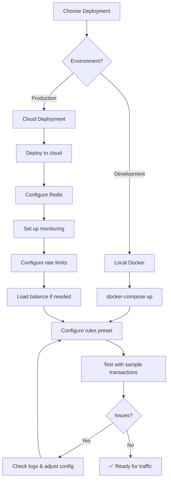
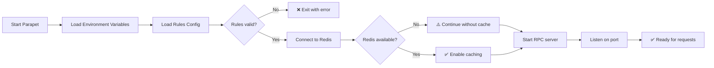

# Operations Guide

**For:** DevOps teams deploying and operating Parapet

## Deployment Workflow




## Configuration Flow




## Monitoring

### Key Metrics

```bash
# Request rate
grep "sendTransaction" /var/log/parapet/app.log | wc -l

# Block rate
grep "🚫 Transaction BLOCKED" /var/log/parapet/app.log | wc -l

# Error rate
grep "ERROR" /var/log/parapet/app.log | wc -l
```

### Health Check

```bash
curl http://localhost:8899 \
  -H "Content-Type: application/json" \
  -d '{"jsonrpc":"2.0","id":1,"method":"getHealth"}'
```

### Redis Monitoring

```bash
redis-cli info stats
redis-cli dbsize
redis-cli slowlog get 10
```

## Logs

**Location:** `/var/log/parapet/app.log` (systemd) or stdout

**Log Levels:**

```bash
# Production
RUST_LOG=info

# Debug
RUST_LOG=debug,parapet_rpc_proxy=trace

# Quiet
RUST_LOG=warn
```

**Important Patterns:**

- `🚫 BLOCKED` - Security block
- `⚠️ ALERT` - Warning
- `Rate limit exceeded` - Quota reached
- `ERROR` - System error

## Scaling

### Vertical (Single Instance)

- 1 core → ~1000 req/s
- 2 cores → ~2500 req/s
- 4 cores → ~5000 req/s

### Horizontal (Multiple Instances)

- Use Redis (required for shared state)
- Load balancer in front
- Shared rules.json via mount

**Example:**

```
           ┌──→ Instance 1 ─┐
LB (nginx) ├──→ Instance 2 ─┼──→ Redis
           └──→ Instance 3 ─┘
```

## Backup

### Redis Data

```bash
# Backup
redis-cli save
cp /var/lib/redis/dump.rdb /backup/redis-$(date +%F).rdb

# Restore
sudo systemctl stop redis
cp /backup/redis-2024-01-01.rdb /var/lib/redis/dump.rdb
sudo systemctl start redis
```

### Configuration

```bash
# Backup
tar czf parapet-config-$(date +%F).tar.gz \
  /opt/parapet/.env \
  /opt/parapet/rules.json \
  /opt/parapet/analyzers/

# Restore
tar xzf parapet-config-2024-01-01.tar.gz -C /
```

## Updates

### Zero-Downtime Update

```bash
# 1. Test new version in staging
cd /opt/parapet
git pull
cargo build --release

# 2. Rolling restart (if clustered)
sudo systemctl stop parapet@instance1
# Wait for health check
sudo systemctl start parapet@instance1
# Repeat for other instances

# 3. Single instance
sudo systemctl reload parapet  # if supported
# or
sudo systemctl restart parapet
```

### Rules Update (Hot Reload)

```bash
# Edit rules
vim /opt/parapet/rules.json

# No restart needed - watched file reloads automatically
# Check logs for: "Rules reloaded"
```

## Disaster Recovery

### Instance Failure

1. Load balancer auto-routes to healthy instances
2. Spawn new instance
3. Points to same Redis
4. Automatic recovery

### Redis Failure

1. Proxy continues with in-memory cache
2. No rate limiting (temporary)
3. Restore Redis from backup
4. Restart proxy to reconnect

### Data Loss

1. Rate limit counters reset (acceptable - monthly window)
2. Blocklist reloads from rules.json on restart

## Performance Tuning

### Redis

```conf
# /etc/redis/redis.conf
maxmemory 256mb
maxmemory-policy allkeys-lru
```

### Proxy

```bash
# Increase worker threads
TOKIO_WORKER_THREADS=4

# Disable unused features
ENABLE_USAGE_TRACKING=false  # if not needed
```

### WASM

```bash
# Disable if not using
unset WASM_ANALYZERS_PATH
```

## Alerts

Set up alerts for:

- Error rate >1%
- Block rate >50%
- Response time >100ms
- Redis connection failures
- Disk space <20%

## Maintenance Window

1. Announce downtime
2. Stop accepting new requests (LB)
3. Wait for in-flight requests
4. Perform maintenance
5. Test
6. Resume traffic

## Multi-upstream RPC (proxy and API)

Shared logic lives in the **`parapet-upstream`** crate: HTTP JSON-RPC to Solana with retries, per-endpoint circuit breakers, and pluggable routing (`UpstreamProvider`). Production guidance below is for operators and for agents editing config.

### What you get

- **Failover (default):** If the primary returns retryable errors (HTTP 429, 5xx), DNS/connect failures, or timeouts, the proxy or API tries the next endpoint in priority order. Each URL has its own circuit breaker so one bad host does not poison the whole stack.
- **Smart routing (optional):** With `strategy = "smart"` (proxy) or `UPSTREAM_STRATEGY=smart`, requests can be steered using latency and slot hints between endpoints. Tune **`smart_max_slot_lag`** (default `20`) / **`UPSTREAM_SMART_MAX_SLOT_LAG`** when endpoints disagree on slot by more than you tolerate.
- **Method policy (proxy):** Optional allowlist or blocklist for JSON-RPC method names (useful when exposing the proxy like a public RPC). Blocklist is applied before allowlist.

### RPC proxy (`parapet-rpc-proxy`)

**Choose one shape for upstream (validation enforces this):**

1. **Single URL** — Set `[upstream].url` and leave `[[upstream.endpoint]]` empty.
2. **Multiple endpoints** — Omit `url` (or leave empty) and define one or more `[[upstream.endpoint]]` blocks. **`priority`** is ascending order (lower number = tried first).

Shared HTTP tuning on `[upstream]` (`max_concurrent`, `delay_ms`, `timeout_secs`, retries, circuit breaker) applies to single-URL mode and is the **default** for each endpoint in multi-endpoint mode. An endpoint may override any of those fields with its own keys on `[[upstream.endpoint]]`.

**Strategy (multi-endpoint only):**

- Omit or use failover semantics: priority-ordered failover (default).
- `strategy = "smart"` in TOML or `UPSTREAM_STRATEGY=smart` in the environment for smart routing (ignored when only one URL is configured).

**Environment overrides** (when set, they override TOML for the same fields):

| Purpose | Variables |
| --------| ----------|
| Upstream URLs | `UPSTREAM_RPC_URL` (one URL) **or** `UPSTREAM_RPC_URLS` (comma-separated list). Do not rely on setting both; prefer one list. |
| Strategy | `UPSTREAM_STRATEGY`, `UPSTREAM_SMART_MAX_SLOT_LAG` |
| HTTP / breaker defaults | `UPSTREAM_MAX_CONCURRENT`, `UPSTREAM_DELAY_MS`, `UPSTREAM_TIMEOUT_SECS`, `UPSTREAM_MAX_RETRIES`, `UPSTREAM_RETRY_BASE_DELAY_MS`, `UPSTREAM_CIRCUIT_BREAKER_THRESHOLD`, `UPSTREAM_CIRCUIT_BREAKER_TIMEOUT_SECS` |
| Method policy | `ALLOWED_RPC_METHODS`, `BLOCKED_RPC_METHODS` (comma-separated method names) |

**Env-only mode** (no `config.toml`): `UPSTREAM_RPC_URL` **or** `UPSTREAM_RPC_URLS` is required, plus the other proxy env vars documented in `rpc-proxy/README.md`.

**Authoritative templates:** `rpc-proxy/config.toml.example`, full key tables in `rpc-proxy/README.md`.

### API (`parapet-api`)

Escalations and other flows that **forward JSON-RPC** use the same upstream stack as the proxy crate pattern:

- TOML: `[solana].rpc_url` for a single endpoint, **or** `rpc_urls = ["https://...", "https://..."]` for ordered failover.
- Environment: `SOLANA_RPC_URL` or comma-separated `SOLANA_RPC_URLS`.

See `api/config.example.toml` for comments. **`upstream_rpc()`** in application state is an `Arc<dyn UpstreamProvider>` built from those URLs.

### Scanner and MCP

- **Best resilience:** Point **`SOLANA_RPC_URL`** (or the scanner’s `--rpc` / comma-separated list) at **your Parapet RPC proxy** so failover and policy live in one place.
- **Comma-separated URLs** in CLI or env: the stack may use them where HTTP forwarding exists; **blocking Solana `RpcClient` paths still use the first URL only** — document that limitation for operators automating with the raw SDK client.

### Related docs

- [rpc-proxy/README.md](../rpc-proxy/README.md) — `[upstream]`, `[[upstream.endpoint]]`, `[security]` method lists, env-only table.
- [USER_GUIDE.md](USER_GUIDE.md) — Quick env examples for local runs.

