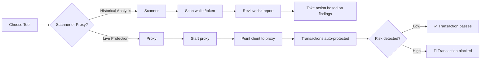

# Parapet User Guide

**For:** End users running Parapet tools (scanner, proxy)

## Workflow Overview



## Quick Start

### Scanner - Analyze Wallet Transactions

Scan a wallet's transaction history for security risks:

```bash
# Scan wallet
cargo run -p parapet-scanner -- \
  --wallet 7xKXtg2CW87d97TXJSDpbD5jBkheTqA83TZRuJosgAsU \
  --rpc https://api.mainnet-beta.solana.com

# Save results
cargo run -p parapet-scanner -- \
  --wallet YOUR_WALLET \
  --output scan-results.json
```

**Output shows:**
- Risk score for each transaction
- Security warnings and matched rules
- Summary statistics

### Proxy - Protect Live Transactions

Run the RPC proxy to protect transactions in real-time:

```bash
# Start proxy
cargo run -p parapet-rpc-proxy -- \
  --upstream-rpc https://api.mainnet-beta.solana.com \
  --port 8899

# Or use environment variables
export UPSTREAM_RPC_URL=https://api.mainnet-beta.solana.com
cargo run -p parapet-rpc-proxy
```

Then point your Solana client to `http://localhost:8899`.

## Configuration

### Environment Variables

```bash
# Required
UPSTREAM_RPC_URL=https://api.mainnet-beta.solana.com

# Optional
PROXY_PORT=8899
DEFAULT_BLOCK_THRESHOLD=70        # 0-100, higher = more permissive
REDIS_URL=redis://localhost:6379  # For caching/rate limiting
RUST_LOG=info                     # Log level
```

### Rules Configuration

Customize which security rules are active:

```bash
# Use preset (specify path to preset file)
cargo run -p parapet-rpc-proxy -- --rules rpc-proxy/rules/presets/default-protection.json

# Or custom rules file
cargo run -p parapet-rpc-proxy -- --rules rpc-proxy/rules/custom-rules.json
```

**Available Presets:**
- `default-protection.json` - Balanced security and usability
- `bot-essentials.json` - Essential protection for automated bots
- `wallet-scan-enhanced.json` - Enhanced scanning for wallet analysis

### Custom Rules

Copy and edit a preset:

```bash
cp rpc-proxy/rules/presets/default-protection.json rpc-proxy/rules/my-rules.json
# Edit my-rules.json to adjust weights and thresholds
cargo run -p parapet-rpc-proxy -- --rules rpc-proxy/rules/my-rules.json
```

## Understanding Risk Scores

Risk scores range from 0-100:
- **0-30**: Low risk (safe)
- **31-60**: Medium risk (warnings)
- **61-100**: High risk (may be blocked)

Transactions are blocked when `risk_score >= threshold` (default: 70).

## Common Use Cases

### Protecting a Bot Wallet

```bash
# Run proxy with bot-essentials rules
export UPSTREAM_RPC_URL=https://api.mainnet-beta.solana.com
export DEFAULT_BLOCK_THRESHOLD=60  # Block more aggressively
cargo run -p parapet-rpc-proxy -- --rules rpc-proxy/rules/presets/bot-essentials.json

# Configure bot to use http://localhost:8899
```

### Scanning Before Trading

```bash
# Scan a token's recent transactions
cargo run -p parapet-scanner -- \
  --token EPjFWdd5AufqSSqeM2qN1xzybapC8G4wEGGkZwyTDt1v \
  --limit 100
```

### Monitoring Wallet Activity

```bash
# Continuous monitoring (checks every 60s)
cargo run -p parapet-scanner -- \
  --wallet YOUR_WALLET \
  --watch \
  --interval 60
```

## Checking Logs

```bash
# View proxy logs
RUST_LOG=info cargo run -p parapet-rpc-proxy

# Debug mode (verbose)
RUST_LOG=debug cargo run -p parapet-rpc-proxy

# Save logs to file
cargo run -p parapet-rpc-proxy 2>&1 | tee parapet.log
```

**Look for:**
- `✅ Transaction PASSED` - Safe transaction
- `⚠️  Transaction has warnings` - Medium risk
- `🚫 Transaction BLOCKED` - High risk, blocked

## Troubleshooting

### Proxy won't start
- Check `UPSTREAM_RPC_URL` is set and reachable
- Verify port 8899 is not in use: `lsof -i :8899`

### Too many false positives
- Increase threshold: `DEFAULT_BLOCK_THRESHOLD=80`
- Use a less restrictive preset or create custom rules

### Missing Redis errors
- Redis is optional for caching
- Set `REDIS_URL` or ignore warnings

## Getting Help

- Check logs with `RUST_LOG=debug`
- See `rpc-proxy/README.md` for more proxy options
- See `scanner/README.md` for more scanner options
