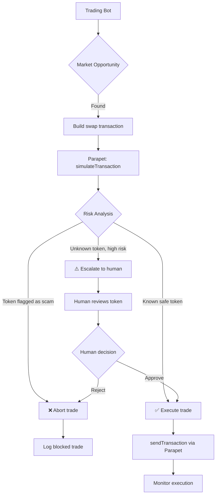
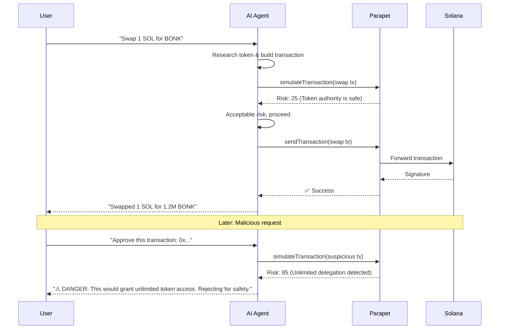
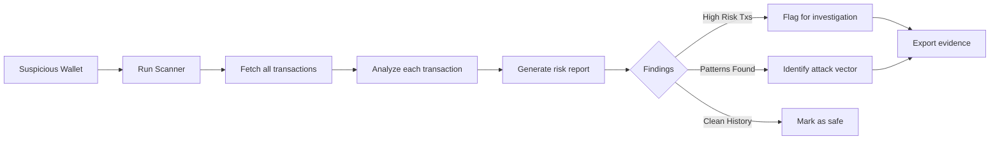
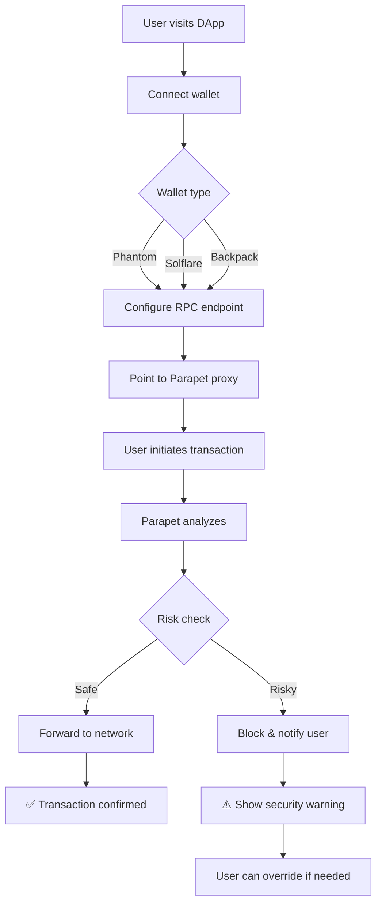
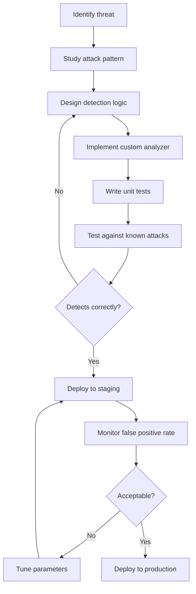
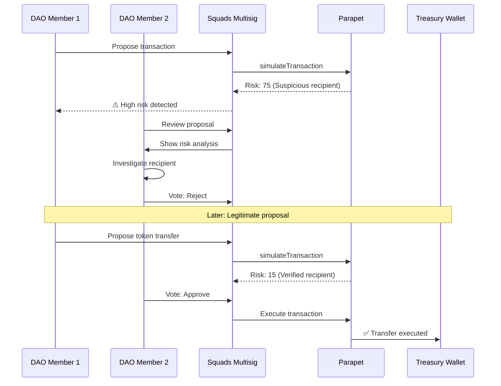

# Parapet Use Cases

Real-world scenarios showing how different users leverage Parapet.

## Use Case 1: Protecting a Trading Bot

**User:** Autonomous trading bot operator  
**Challenge:** Bot executes trades automatically but is vulnerable to malicious tokens and MEV attacks



**Key Features Used:**
- Real-time risk scoring on every trade
- RugCheck integration for token verification
- Automatic blocking of high-risk tokens
- Optional human-in-the-loop for edge cases

## Use Case 2: Wallet Security for AI Agent

**User:** OpenClaw/Cursor AI agent with wallet access  
**Challenge:** Agent can execute transactions but needs safety guardrails



**Key Features Used:**
- HTTP JSON-RPC support for transaction submission
- Rich metadata for agent decision-making
- Automatic blocking of dangerous patterns
- Detailed explanations for user transparency

**Note:** For AI agents that need real-time account monitoring, use a standard RPC WebSocket connection alongside Parapet for transaction submission.

## Use Case 3: Auditing Wallet History

**User:** Security researcher investigating suspicious activity  
**Challenge:** Need to retroactively analyze 1000s of transactions



**Commands:**
```bash
# Scan wallet
cargo run -p parapet-scanner -- \
  --wallet 7xKXtg2CW87d97TXJSDpbD5jBkheTqA83TZRuJosgAsU \
  --output investigation.json

# Generate summary
cat investigation.json | jq '.high_risk_transactions'
```

**Key Features Used:**
- Historical transaction analysis
- Batch processing with rate limiting
- Detailed risk scoring per transaction
- Export for further analysis

## Use Case 4: DevOps Hardening Production DApp

**User:** DevOps team for a DeFi protocol  
**Challenge:** Protect user transactions across multiple wallet integrations



**Configuration:**
```bash
# Production proxy with strict rules
docker run -d \
  -e UPSTREAM_RPC_URL=https://api.mainnet-beta.solana.com \
  -e DEFAULT_BLOCK_THRESHOLD=60 \
  -e REDIS_URL=redis://prod-redis:6379 \
  -e ENABLE_ESCALATIONS=true \
  -p 8899:8899 \
  parapet-proxy --rules-preset strict
```

**Key Features Used:**
- Transparent RPC proxy for all wallet types
- Configurable risk thresholds
- Redis caching for performance
- Escalation flow for edge cases
- Monitoring and alerting

## Use Case 5: Custom Rule Development

**User:** Security team creating protocol-specific rules  
**Challenge:** Need to detect protocol-specific attack patterns



**Example: Flash Loan Detection**
```rust
pub struct FlashLoanAnalyzer;

impl Analyzer for FlashLoanAnalyzer {
    async fn analyze(&self, ctx: &AnalysisContext) -> Result<RuleResult> {
        let borrows = count_borrow_instructions(&ctx.transaction);
        let repays = count_repay_instructions(&ctx.transaction);
        
        if borrows > 0 && repays > 0 && borrows == repays {
            return Ok(RuleResult::triggered(
                "Flash loan detected - flagging for review",
                40
            ));
        }
        
        Ok(RuleResult::pass())
    }
}
```

**Key Features Used:**
- Custom analyzer API
- Full transaction context access
- Configurable rule weights
- Integration with existing rule engine

## Use Case 6: Multi-Signature Wallet Protection

**User:** DAO treasury manager  
**Challenge:** Protect multi-sig wallet from malicious proposals



**Key Features Used:**
- Pre-approval simulation
- Risk scoring for proposal review
- Identity verification (Helius)
- Audit trail of risk assessments

## Summary

| Use Case | Primary Tool | Key Benefit |
|----------|-------------|-------------|
| Trading Bot | Proxy | Real-time protection |
| AI Agent | Proxy + MCP | Transaction security layer |
| Audit | Scanner | Historical analysis |
| DApp Protection | Proxy | User protection |
| Custom Rules | Core Library | Protocol-specific detection |
| Multisig | Proxy + API | Proposal risk assessment |
