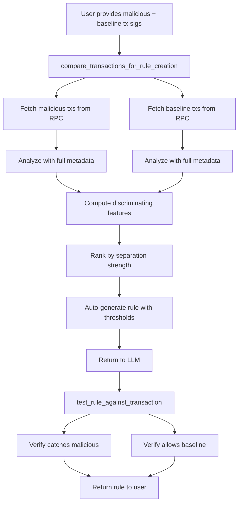

# Parapet Rule Creation MCP Tools

**Status:** Design Complete, Not Yet Implemented  
**Last Updated:** 2026-04-12

## Overview

Extend `parapet-mcp` with **differential analysis** tools that compare malicious vs baseline transactions to identify discriminating features and suggest precise rules. The design reuses existing infrastructure from `parapet-core` and follows the rich analysis pattern from `parapet/scanner/src/bin/tx-check.rs`.

## Core Insight: Differential Analysis

Instead of analyzing a single malicious transaction in isolation, comparing it against baseline (normal) transactions reveals:

- Which analyzer fields actually discriminate between good and bad behavior
- Automatic threshold calculation (midpoint between malicious and baseline ranges)
- Zero false positives by design (tested against baseline set)
- Confidence metrics (perfect vs strong vs weak discriminators)

## Architecture




## New MCP Tools

### 1. `compare_transactions_for_rule_creation` (Primary Tool)

**Purpose:** Differential analysis comparing malicious vs baseline transactions to identify discriminating features and auto-suggest rules.

**Inputs:**

- `malicious_signatures` (string[]): Array of known malicious transaction signatures (min 1, recommended 3-5)
- `baseline_signatures` (string[]): Array of known good/normal transaction signatures (min 1, recommended 3-5)
- `analyzer_filter` (string[], optional): Focus on specific analyzers (default: all available)
- `include_logs` (bool, optional): Include transaction logs in output (default: false)

**Output:**

```typescript
{
  "malicious_analysis": {
    "transaction_count": 3,
    "common_fields": {
      "security.delegation_is_unlimited": true,
      "token_instructions.has_approval": true
    },
    "field_ranges": {
      "security.risk_score": { "min": 75, "max": 90, "avg": 82.3 },
      "basic.delegation_count": { "min": 2, "max": 4, "avg": 3.0 }
    }
  },
  "baseline_analysis": {
    "transaction_count": 5,
    "common_fields": {
      "security.delegation_is_unlimited": false,
      "token_instructions.has_approval": false
    },
    "field_ranges": {
      "security.risk_score": { "min": 10, "max": 25, "avg": 17.2 },
      "basic.delegation_count": { "min": 0, "max": 1, "avg": 0.4 }
    }
  },
  "discriminating_features": [
    {
      "field": "security.delegation_is_unlimited",
      "malicious_value": true,
      "baseline_value": false,
      "separation": "perfect",
      "confidence": 1.0,
      "suggested_condition": {
        "field": "security.delegation_is_unlimited",
        "operator": "equals",
        "value": true
      }
    },
    {
      "field": "security.risk_score",
      "malicious_range": [75, 90],
      "baseline_range": [10, 25],
      "separation": "strong",
      "confidence": 0.95,
      "suggested_threshold": 50,
      "suggested_condition": {
        "field": "security.risk_score",
        "operator": "greater_than",
        "value": 50
      }
    }
  ],
  "suggested_rule": {
    "version": "1.0",
    "id": "auto_generated_rule",
    "name": "Suggested rule from differential analysis",
    "enabled": true,
    "rule": {
      "action": "alert",
      "conditions": {
        "all": [
          {"field": "security.delegation_is_unlimited", "operator": "equals", "value": true}
        ]
      },
      "message": "Transaction matches pattern from malicious samples"
    },
    "metadata": {
      "generated_by": "mcp_differential_analysis",
      "malicious_sample_count": 3,
      "baseline_sample_count": 5,
      "confidence": 0.95
    }
  },
  "analysis_confidence": {
    "overall": "moderate",
    "factors": {
      "analyzer_coverage": "moderate",
      "sample_size": "adequate",
      "discriminator_strength": "strong",
      "field_population": 0.85
    },
    "limitations": [
      "Wallet reputation data unavailable (helius not configured)",
      "Token analysis unavailable (rugcheck not enabled)"
    ],
    "could_improve_with": [
      "helius_identity analyzer for wallet labeling",
      "rugcheck analyzer for token risk scoring"
    ]
  }
}
```

### 2. `get_analyzer_capabilities` (Pre-flight Discovery)

Shows which analyzers are available, enabled, and configured.

**Output:**

```typescript
{
  "core_analyzers": {
    "available": [
      {
        "name": "security",
        "status": "available",
        "fields": ["risk_score", "delegation_is_unlimited", "blocked_program_detected"],
        "latency_ms": 5
      }
    ]
  },
  "third_party_analyzers": {
    "available": [...],
    "unavailable": [...]
  },
  "coverage_assessment": {
    "level": "moderate",
    "capabilities": [
      "Basic structural analysis ✓",
      "Security pattern detection ✓",
      "Wallet reputation ✗ (helius not configured)"
    ],
    "recommendations": [
      "Configure HELIUS_API_KEY for wallet reputation analysis"
    ]
  }
}
```

### 3. `validate_rule`

Validates rule JSON against the current analyzer registry.

### 4. `test_rule_against_transaction`

Tests whether a rule would match specific transactions (single or batch).

**Supports:**

- Single transaction testing
- Batch testing with accuracy metrics
- Expected outcome validation (true positives, false positives, etc.)

### 5. `analyze_single_transaction`

Fallback for when user only has one malicious transaction (warns about lack of baseline context).

## Security Model: Dev Mode Toggle

### Access Control

Rule creation tools are gated behind "dev mode" enabled via:

1. **Server config:** `PARAPET_ENABLE_DEV_TOOLS=true`
2. **Per-request header:** `X-Parapet-Dev-Mode: true`

### Deployment Configurations


| Environment           | `enable_dev_tools` | Usage                           |
| --------------------- | ------------------ | ------------------------------- |
| **Production**        | `false` (default)  | Dev tools completely disabled   |
| **Staging/Dev**       | `true`             | Dev tools available with header |
| **Local development** | `true`             | Dev tools available for testing |


### Why Dev Mode?

- **Operational:** These tools do expensive RPC batch operations
- **Use case:** Rule creation is development/research work, not end-user feature
- **Rate limiting:** Higher quota costs for batch operations
- **Flexibility:** Can enable/disable per deployment without code changes

## Example Workflow

**Differential Analysis:**

1. User: "These are drainer txs [sig1, sig2, sig3], these are normal Raydium swaps [sig4, sig5, sig6]"
2. MCP: `compare_transactions_for_rule_creation({malicious: [...], baseline: [...]})`
3. Returns:
  ```
   Analysis confidence: MODERATE
   Discriminating features found:
   - delegation_is_unlimited: true vs false - PERFECT separation
   - risk_score: [75-90] vs [10-25] - STRONG separation

   Suggested rule: Check delegation_is_unlimited == true (confidence: 1.0)
  ```
4. LLM creates rule JSON
5. MCP: `test_rule_against_transaction({rule, signatures: [all 6 txs]})`
6. Returns: Matched 3/3 malicious, 0/3 false positives, 100% accuracy
7. Rule ready for deployment

## Implementation Notes

### Reusable Components

- `RpcClient::get_transaction_with_config` for fetching
- `AnalyzerRegistry::analyze_selected_with_metadata` for analysis
- `RuleEngine::validate_rule` for validation
- Pattern from `tx-check.rs` for metadata extraction

### Key Features

- **Automatic threshold selection** from data separation
- **Confidence scoring** based on analyzer coverage, sample size, discriminator strength
- **Shallow analysis detection** warns when < 30% of fields populated
- **Smart recommendations** suggests specific analyzers based on transaction characteristics

### Edge Cases

- V0 transactions with unresolved ALTs (limited analysis)
- Insufficient samples (warn if < 3 per set)
- No discriminating features found (explicit warning)
- Baseline contamination detection
- Missing third-party analyzers (graceful degradation)

## Benefits

- **Automatic threshold selection** - No guessing, derived from actual data
- **Zero false positives by design** - Tested against baseline during creation
- **Confidence metrics** - Users know which discriminators are reliable
- **Iterative refinement** - Easy to add more samples to improve accuracy
- **LLM-native** - Exposes discriminating features, not just raw data
- **Educational** - Shows exactly what makes transactions malicious vs normal

## Future Enhancements

- API key-based permissions (bypass header requirement)
- Rule templates library
- Historical pattern search (find similar past attacks)
- Flowbit rule generation for velocity/frequency patterns
- Integration with rule deployment APIs

